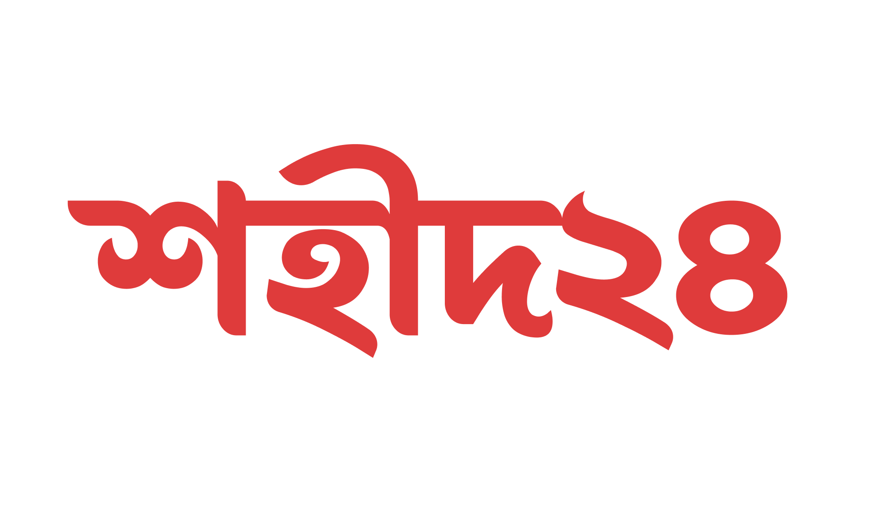

  

# Shohid24

[A website](https://shohid24.pages.dev/) listing the martyrs of the July Student Movement 2024 in Bangladesh.

After the July Student Movement, numerous attempts were made to compile a list of students who were martyred during the protests. However, these lists were often closed-source, and the associated websites frequently became inaccessible.

To solve this issue, I created **Shohid24**. Built as a static Next.js site, it ensures high availability and minimal chances of downtime. In the unlikely event that the website becomes unreachable, this repository will remain accessible.

**My brothers died in the protest, for me. This is the least I could do.**

### Key Features

- **Open Source**: Anyone can contribute to or verify the content of the repository.
- **Static Site**: Cloudflare pages gives unlimited static bandwidth. Therefore, no downtime.
- **Updatable Data**: Data is updated regularly.
- **Collaborative**: Contributions from the community help keep the repository current and comprehensive.

## Why This Project?

The July Student Movement of 2024 was a significant moment in Bangladesh’s history. Students stood against systemic inequalities and sacrificed their lives for justice and equal opportunities. This repository aims to honor their memory and ensure that future generations remember their sacrifices.

## How to Contribute

1. **Submit a New Martyr**: If you have verified information about a martyr not listed on the website, you can contribute by submitting their details. [Submit a martyr](https://forms.gle/efEVqZEHHR4fZuyG7).

2. **Update Data**: Found incorrect information? Open an issue. Or message us directly in [Telegram](https://t.me/Shohid24Discussion/)

3. **Spread the Word**: Share this repository to ensure that the sacrifices of these heroes are not forgotten.

## The July Student Movement 2024

The July Student Movement began as a response to the reinstatement of a controversial quota system that reserved 30% of civil service jobs for descendants of Liberation War veterans. This policy led to nationwide protests, with students from Dhaka University at the forefront, demanding fairness and the abolition of discriminatory practices.

The movement saw participation from students across Bangladesh and eventually led to significant political changes in the country. Sadly, many lives were lost during the protests due to violent crackdowns.

## Let’s Not Forget

This repository is more than just a list of names. It’s a tribute to the bravery and sacrifice of those who fought for justice and equality. Together, let us ensure their memories remain alive.

Let’s unite to remember the heroes who gave their lives for their motherland. Let’s not forget them.
